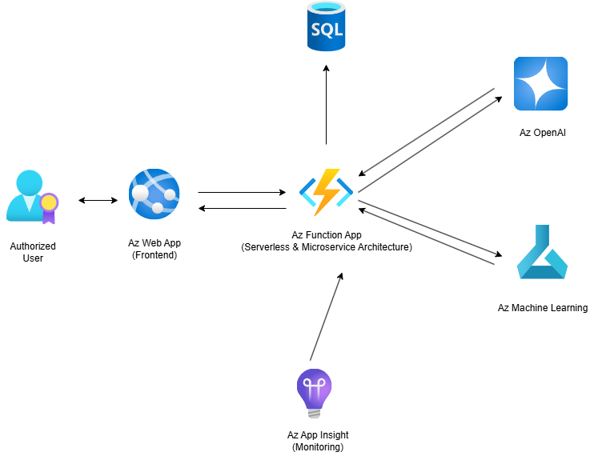

# Sound Realty Property Valuation System

A full-stack machine learning solution that provides instant, data-driven property valuations for Sound Realty's real estate business

## 🏠 Project Overview

This project addresses Sound Realty's challenge of manual, time-consuming property valuation by deploying a machine learning model as a scalable REST API with a modern React frontend. The system automatically enriches property data with demographic information and provides instant price estimates.

## Key Features

- **Instant Valuation**: Get property price estimates in seconds

- **Automatic Data Enrichment**: Seamlessly integrates U.S. Census demographic data

- **Modern Web Interface**: User-friendly React frontend for agents

- **Scalable API**: Flask backend designed for production use

- **Model Versioning Ready**: Supports zero-downtime model updates

## 🏗️ Architecture

```
sound-realty-valuation/
├── 📁 backend/                # Flask REST API
├── 📁 frontend/               # React Application
```

## 🐳 Docker Deployment

    ### Build Image

    - docker build -t flask-app .

    ### Run Container

    - docker run -d -p 5000:5000 flask-app

## 📡 API Endpoints

- POST /predict

## 🧠 Machine Learning Model

    ### Model Detail

    - Algorithm: K-Nearest Neighbors Regressor with RobustScaler

    - Training Script: create_model.py

    - Features: 6 core property attributes + demographic enrichment

    - Preprocessing: Automatic scaling and data validation

    ### Model Training

    - Load and preprocess training data

    - Train the KNN model pipeline

    - Save artifacts to model/ directory

    - Generate performance metrics

## ⚙️ Configuration

    ### Key Dependencies

    - Flask: Web framework for API endpoints

    - Scikit-learn: Machine learning model pipeline

    - Pandas: Data manipulation and demographic enrichment

    - Joblib/Pickle: Model serialization

## 📊 Model Performance

- Algorithm: K-Nearest Neighbors for intuitive "similar properties" approach

- Data Enrichment: Automatic zipcode-based demographic integration

- Robustness: Handles outliers through RobustScaler preprocessing

- Interpretability: Easy to understand and explain to stakeholders

## Suggestion for Model Upgrading

    ### Implementation Order

    - Feature Engineering

        Using PCA for Dimensionality reduction

    - Algorithm Upgrading

        Replace KNN with gradient boosting

        Ensemble Methods - Stacking or voting

    - Hyperparameter Tuning

        Quick grid search

    - Automated Retraining MLOps pipeline

    - Model Monitoring

        Performance drift detection

    - A/B Testing

        Controlled model Comparison

## Suggestion for Structure Upgrading

    ### Change the Structure into new based on AWS or Azure

<p align="center">
  
  <br>
  <i>Structure Based on Azure</i>
</p>
